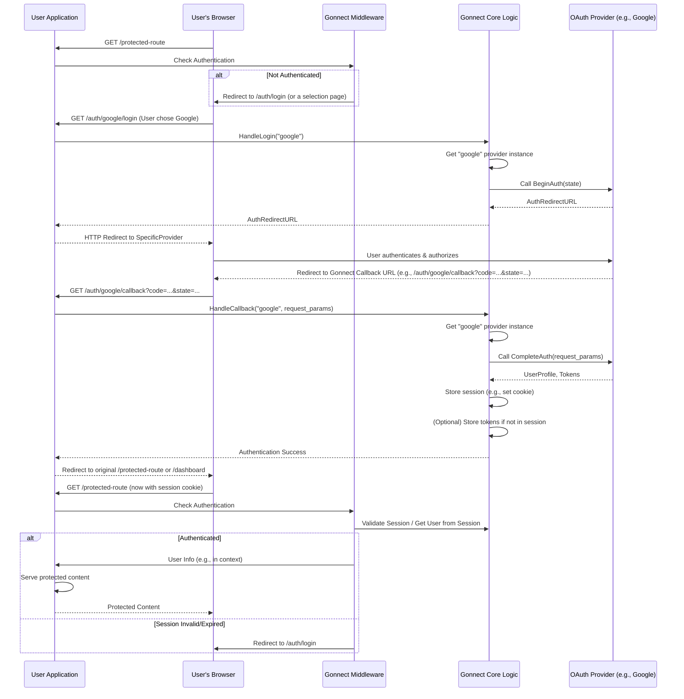

## Gonnect Technical Plan

### 1. Core Goals

*   **Modularity**: Each authentication provider should be a self-contained unit.
*   **Extensibility**: Adding new providers should be straightforward.
*   **Minimalism**: Only explicitly configured providers should be loaded into memory.
*   **Security**: Adhere to OAuth2 and OpenID Connect best practices.
*   **Ease of Use**: Provide a simple and consistent API for developers.

### 2. Code Standard

*   **Go Standard Library**: Prioritize the use of Go's standard library.
*   **Effective Go**: Follow the guidelines outlined in Effective Go.
*   **Error Handling**: Consistent and clear error handling. Return errors rather than panicking.
*   **Testing**: Comprehensive unit tests for all packages and providers.
*   **Formatting**: `gofmt` for all Go code.
*   **Linting**: Use `golangci-lint` with a sensible default configuration.
*   **Documentation**: `godoc` compatible comments for all public APIs. Clear `README.md` and `TECHNICAL.md` (this document).

### 3. Folder Structure

```
gonnect/
├── go.mod                 // Module definition (module github.com/megascan/gonnect)
├── go.sum                 // Dependencies
├── LICENSE
├── README.md
├── TECHNICAL.md           // This document
│
├── gonnect.go             // Core Gonnect client, main API, provider interfaces
├── session.go             // Session management implementation
├── handlers.go            // HTTP handlers for auth flows
├── middleware.go          // Web framework middleware
├── errors.go              // Error types and handling
│
├── providers/             // Individual provider implementations
│   ├── google/
│   │   └── google.go      // Google provider logic
│   ├── github/
│   │   └── github.go      // GitHub provider logic
│   ├── discord/
│   │   └── discord.go     // Discord provider logic
│   ├── steam/
│   │   └── steam.go       // Steam OpenID 2.0 provider
│   └── ...                // Other providers
│
├── internal/              // Private library code (not importable by others)
│   ├── crypto/            // Encryption utilities for sessions
│   │   └── crypto.go
│   └── utils/             // Common utilities
│       └── utils.go
│
├── examples/              // Example usage of Gonnect
│   ├── basic/
│   │   └── main.go        // Basic usage example
│   ├── chi/
│   │   └── main.go        // Chi router integration
│   └── gin/
│       └── main.go        // Gin framework integration
│
├── docs/                  // Documentation
│   ├── providers.md       // Provider-specific documentation
│   ├── security.md        // Security best practices
│   └── migration.md       // Migration guides
│
└── cmd/                   // CLI tools (if needed)
    └── gonnectcli/
        └── main.go
```

**Rationale for this structure:**

*   `pkg/`: This is the standard location for Go library code that is intended to be imported by other projects.
*   `internal/`: For any helper code that is not meant to be part of the public API.
*   `providers/`: This is key for modularity. Each subdirectory will contain the specific implementation for an OAuth2/OpenID Connect provider. This allows for clear separation and ensures that only providers explicitly imported and configured by the user are compiled into their application.
*   `examples/`: Essential for demonstrating how to use the library.
*   `cmd/`: For any potential command-line interface related to the project.

### 4. Simple, Go-Idiomatic API Design

*   **Core Philosophy**: Follow Go's principle of "simple things should be simple, complex things should be possible"
*   **API Design**: Method chaining with sensible defaults, similar to `net/http` and `database/sql`
*   **Progressive Disclosure**: Simple constructor for common cases, advanced config for complex needs

*   **Core Types and Interfaces**:
    ```go
    // gonnect.go
    package gonnect

    import (
        "context"
        "fmt"
        "net/http"
        "time" 
    )

    // User represents a generic user object returned by a provider.
    type User struct {
        ID          string
        Email       string
        Name        string
        Username    string // For providers where username differs from name
        AvatarURL   string
        Locale      string // User's locale/language preference
        RawData     map[string]interface{} // Original data from provider
    }

    // Config holds the common configuration for a provider.
    // Specific providers can embed this and add their own fields.
    type Config struct {
        ClientID     string
        ClientSecret string
        RedirectURL  string // Gonnect will construct this based on its main URL + path
        Scopes       []string
        // Provider-specific additional configuration
        Extra        map[string]interface{}
    }

    // Provider defines the interface for an authentication provider.
    // This interface accommodates both OAuth2 and OpenID 2.0 flows.
    type Provider interface {
        Name() string
        // BeginAuth initiates the authentication flow
        BeginAuth(ctx context.Context, state string) (redirectURL string, err error)
        // CompleteAuth completes the authentication flow
        CompleteAuth(ctx context.Context, r *http.Request) (user User, tokenData Token, err error)
        // RefreshToken refreshes an access token using a refresh token
        RefreshToken(ctx context.Context, refreshToken string) (newTokenData Token, err error)
        // ValidateToken validates a token and returns user info (for session validation)
        ValidateToken(ctx context.Context, token Token) (user User, valid bool, err error)
        // SupportsRefresh indicates if the provider supports token refresh
        SupportsRefresh() bool
    }

    // Token represents the token data from a provider
    type Token struct {
        AccessToken  string
        RefreshToken string
        Expiry       time.Time
        IDToken      string    // For OIDC providers
        TokenType    string    // Usually "Bearer"
        Scope        string    // Granted scopes
        // Provider-specific token data
        Extra        map[string]interface{}
    }

    // Error types for better error handling
    type ErrorType string

    const (
        ErrTypeConfig           ErrorType = "config_error"
        ErrTypeProvider         ErrorType = "provider_error"
        ErrTypeAuthentication   ErrorType = "auth_error"
        ErrTypeToken           ErrorType = "token_error"
        ErrTypeSession         ErrorType = "session_error"
        ErrTypeValidation      ErrorType = "validation_error"
    )

    // GonnectError represents errors from the Gonnect library
    type GonnectError struct {
        Type    ErrorType
        Message string
        Cause   error
        Provider string // Which provider caused the error
    }

    func (e *GonnectError) Error() string {
        if e.Provider != "" {
            return fmt.Sprintf("gonnect[%s:%s]: %s", e.Provider, e.Type, e.Message)
        }
        return fmt.Sprintf("gonnect[%s]: %s", e.Type, e.Message)
    }

    func (e *GonnectError) Unwrap() error {
        return e.Cause
    }
    ```
*   **Simple API with Method Chaining**:
    ```go
    // Main Gonnect struct - simple and focused
    type Gonnect struct {
        baseURL      string
        secretKey    []byte
        providers    map[string]Provider
        sessionStore SessionStore
        tokenStore   TokenStore
        
        // Configuration
        sessionName     string
        successRedirect string
        failureRedirect string
        logger          Logger
        
        // API/SPA support
        jwtSecret    []byte
        corsEnabled  bool
    }

    // Simple constructor for common cases
    func New(baseURL string) *Gonnect {
        return &Gonnect{
            baseURL:         baseURL,
            secretKey:       generateSecretKey(), // Auto-generate secure key
            providers:       make(map[string]Provider),
            sessionStore:    NewCookieSessionStore(), // Secure defaults
            sessionName:     "gonnect_session",
            successRedirect: "/",
            failureRedirect: "/login",
        }
    }

    // Advanced constructor for complex cases
    func NewWithConfig(cfg Config) *Gonnect {
        g := &Gonnect{
            baseURL:         cfg.BaseURL,
            secretKey:       cfg.SecretKey,
            providers:       make(map[string]Provider),
            sessionStore:    cfg.SessionStore,
            tokenStore:      cfg.TokenStore,
            sessionName:     cfg.SessionName,
            successRedirect: cfg.SuccessRedirect,
            failureRedirect: cfg.FailureRedirect,
            logger:          cfg.Logger,
        }
        
        // Apply sensible defaults
        if g.sessionStore == nil {
            g.sessionStore = NewCookieSessionStore()
        }
        if g.sessionName == "" {
            g.sessionName = "gonnect_session"
        }
        
        return g
    }

    // Method chaining for provider setup (Go-idiomatic)
    func (g *Gonnect) Google(clientID, clientSecret string, scopes ...string) *Gonnect {
        provider := &GoogleProvider{
            clientID:     clientID,
            clientSecret: clientSecret,
            scopes:       scopes,
            redirectURL:  g.baseURL + "/auth/google/callback",
        }
        g.providers["google"] = provider
        return g
    }

    func (g *Gonnect) GitHub(clientID, clientSecret string, scopes ...string) *Gonnect {
        provider := &GitHubProvider{
            clientID:     clientID,
            clientSecret: clientSecret,
            scopes:       scopes,
            redirectURL:  g.baseURL + "/auth/github/callback",
        }
        g.providers["github"] = provider
        return g
    }

    func (g *Gonnect) Discord(clientID, clientSecret string, scopes ...string) *Gonnect {
        provider := &DiscordProvider{
            clientID:     clientID,
            clientSecret: clientSecret,
            scopes:       scopes,
            redirectURL:  g.baseURL + "/auth/discord/callback",
        }
        g.providers["discord"] = provider
        return g
    }

    // Configuration methods (chainable)
    func (g *Gonnect) SetSecret(key string) *Gonnect {
        g.secretKey = []byte(key)
        return g
    }

    func (g *Gonnect) SetSessionName(name string) *Gonnect {
        g.sessionName = name
        return g
    }

    func (g *Gonnect) OnSuccess(path string) *Gonnect {
        g.successRedirect = path
        return g
    }

    func (g *Gonnect) OnFailure(path string) *Gonnect {
        g.failureRedirect = path
        return g
    }

    // Main handler (simple interface)
    func (g *Gonnect) Handler() http.Handler {
        mux := http.NewServeMux()
        
        // Register routes for each provider
        for name := range g.providers {
            mux.HandleFunc("/auth/"+name, g.handleLogin(name))
            mux.HandleFunc("/auth/"+name+"/callback", g.handleCallback(name))
        }
        
        return mux
    }

    // Middleware functions
    func (g *Gonnect) RequireAuth(next http.Handler) http.Handler {
        return http.HandlerFunc(func(w http.ResponseWriter, r *http.Request) {
            user := g.getUser(r)
            if user == nil {
                http.Redirect(w, r, g.failureRedirect, http.StatusFound)
                return
            }
            
            // Add user to context
            ctx := context.WithValue(r.Context(), userContextKey, user)
            next.ServeHTTP(w, r.WithContext(ctx))
        })
    }

    func (g *Gonnect) OptionalAuth(next http.Handler) http.Handler {
        return http.HandlerFunc(func(w http.ResponseWriter, r *http.Request) {
            user := g.getUser(r)
            if user != nil {
                ctx := context.WithValue(r.Context(), userContextKey, user)
                r = r.WithContext(ctx)
            }
            next.ServeHTTP(w, r)
        })
    }

    // Helper function to get user from request context
    func GetUser(r *http.Request) *User {
        if user, ok := r.Context().Value(userContextKey).(*User); ok {
            return user
        }
        return nil
    }

    // API-first methods for React/SPA backends
    func (g *Gonnect) EnableJWT(secret string) *Gonnect {
        g.jwtSecret = []byte(secret)
        return g
    }

    func (g *Gonnect) EnableCORS() *Gonnect {
        g.corsEnabled = true
        return g
    }

    // Get auth URL for frontend-initiated flows
    func (g *Gonnect) GetAuthURL(provider string) http.HandlerFunc {
        return func(w http.ResponseWriter, r *http.Request) {
            if g.corsEnabled {
                g.setCORSHeaders(w)
            }
            
            p, exists := g.providers[provider]
            if !exists {
                http.Error(w, `{"error":"provider not found"}`, 404)
                return
            }
            
            state := g.generateState()
            g.storeState(w, r, state) // Store in session or JWT
            
            authURL, err := p.BeginAuth(r.Context(), state)
            if err != nil {
                http.Error(w, `{"error":"failed to generate auth URL"}`, 500)
                return
            }
            
            w.Header().Set("Content-Type", "application/json")
            json.NewEncoder(w).Encode(map[string]string{
                "authURL": authURL,
                "state":   state,
            })
        }
    }

    // Handle OAuth callback with flexible response (redirect or JSON)
    func (g *Gonnect) HandleCallback(provider string) http.HandlerFunc {
        return func(w http.ResponseWriter, r *http.Request) {
            if g.corsEnabled {
                g.setCORSHeaders(w)
            }
            
            p, exists := g.providers[provider]
            if !exists {
                g.handleCallbackError(w, r, "provider not found")
                return
            }
            
            // Validate state parameter
            if !g.validateState(r) {
                g.handleCallbackError(w, r, "invalid state parameter")
                return
            }
            
            user, token, err := p.CompleteAuth(r.Context(), r)
            if err != nil {
                g.handleCallbackError(w, r, "authentication failed")
                return
            }
            
            // Store user session
            if err := g.createSession(w, r, user, token); err != nil {
                g.handleCallbackError(w, r, "failed to create session")
                return
            }
            
            // Check if this is an API request (wants JSON) or web request (wants redirect)
            if g.isAPIRequest(r) {
                // Return JSON response for SPA/API clients
                response := map[string]interface{}{
                    "success": true,
                    "user":    user,
                }
                
                // Include JWT if enabled
                if g.jwtSecret != nil {
                    jwt, err := g.generateJWT(user)
                    if err == nil {
                        response["token"] = jwt
                    }
                }
                
                w.Header().Set("Content-Type", "application/json")
                json.NewEncoder(w).Encode(response)
            } else {
                // Traditional redirect for web apps
                http.Redirect(w, r, g.successRedirect, http.StatusFound)
            }
        }
    }

    // Validate request (checks both JWT and session)
    func (g *Gonnect) ValidateRequest(r *http.Request) (*User, error) {
        // Try JWT first (for API clients)
        if authHeader := r.Header.Get("Authorization"); authHeader != "" {
            if strings.HasPrefix(authHeader, "Bearer ") {
                token := strings.TrimPrefix(authHeader, "Bearer ")
                return g.validateJWT(token)
            }
        }
        
        // Fall back to session (for web clients)
        return g.getUserFromSession(r)
    }

    // Logout endpoint
    func (g *Gonnect) Logout() http.HandlerFunc {
        return func(w http.ResponseWriter, r *http.Request) {
            if g.corsEnabled {
                g.setCORSHeaders(w)
            }
            
            // Clear session
            g.clearSession(w, r)
            
            if g.isAPIRequest(r) {
                w.Header().Set("Content-Type", "application/json")
                json.NewEncoder(w).Encode(map[string]bool{"success": true})
            } else {
                http.Redirect(w, r, g.failureRedirect, http.StatusFound)
            }
        }
    }

    // Helper methods
    func (g *Gonnect) isAPIRequest(r *http.Request) bool {
        // Check Accept header or X-Requested-With header
        accept := r.Header.Get("Accept")
        return strings.Contains(accept, "application/json") || 
               r.Header.Get("X-Requested-With") == "XMLHttpRequest"
    }

    func (g *Gonnect) setCORSHeaders(w http.ResponseWriter) {
        w.Header().Set("Access-Control-Allow-Origin", "*") // Configure appropriately
        w.Header().Set("Access-Control-Allow-Methods", "GET, POST, OPTIONS")
        w.Header().Set("Access-Control-Allow-Headers", "Content-Type, Authorization")
        w.Header().Set("Access-Control-Allow-Credentials", "true")
    }
    ```

    type Options struct {
        URL          string // Base URL of the application, e.g., http://localhost:8080
        SecretKey    string // For session encryption, CSRF protection (32+ bytes recommended)
        SessionStore SessionStore // Interface for session management
        TokenStore   TokenStore   // Interface for token storage (optional)
        Providers    []ProviderConfigEntry
        // Optional configuration
        SessionName     string        // Name of session cookie (default: "gonnect_session")
        SessionMaxAge   time.Duration // Session expiration (default: 24 hours)
        LoginPath       string        // Path for login selection page (default: "/auth/login")
        CallbackPath    string        // Path pattern for callbacks (default: "/auth/{provider}/callback")
        SuccessRedirect string        // Where to redirect after successful auth (default: "/")
        FailureRedirect string        // Where to redirect after failed auth (default: "/auth/login")
    }

    type Gonnect struct {
        options      Options
        providers    map[string]Provider // map[providerName]ProviderInstance
        sessionStore SessionStore
        tokenStore   TokenStore
        router       *http.ServeMux // Internal router for auth endpoints
    }

    func New(opts Options) (*Gonnect, error) {
        g := &Gonnect{
            options:   opts,
            providers: make(map[string]provider.Provider),
        }

        if opts.URL == "" {
            return nil, fmt.Errorf("gonnect: Options.URL is required")
        }

        for _, pEntry := range opts.Providers {
            if pEntry.Name == "" {
                return nil, fmt.Errorf("gonnect: ProviderConfigEntry.Name is required")
            }
            if pEntry.Factory == nil {
                return nil, fmt.Errorf("gonnect: ProviderConfigEntry.Factory is required for provider %s", pEntry.Name)
            }

            // Construct the common RedirectURL for this provider
            // This assumes a path structure like /auth/{provider}/callback
            redirectURL := opts.URL + "/auth/" + pEntry.Name + "/callback"
            
            // Create a mutable copy of the config to set the RedirectURL
            providerSpecificConfig := pEntry.Config 
            providerSpecificConfig.RedirectURL = redirectURL

            instance, err := pEntry.Factory(providerSpecificConfig)
            if err != nil {
                return nil, fmt.Errorf("gonnect: failed to initialize provider %s: %w", pEntry.Name, err)
            }
            
            // Check if the name returned by the instance matches the configured name,
            // though usually the factory would set this up correctly.
            // if instance.Name() != pEntry.Name {
            //    return nil, fmt.Errorf("gonnect: provider instance name ('%s') does not match configured name ('%s')", instance.Name(), pEntry.Name)
            // }

            g.providers[pEntry.Name] = instance
        }
        // TODO: Initialize session manager, etc. based on opts.SecretKey, opts.SessionStore
        return g, nil
    }

    // AuthHandlers would create http.HandlerFuncs for /auth/{provider}/login and /auth/{provider}/callback
    func (g *Gonnect) AuthHandlers() http.Handler {
        // TODO: Implement mux or router that routes based on provider name from URL path
        // Example: /auth/{provider}/login -> calls BeginAuth on g.providers[provider]
        // Example: /auth/{provider}/callback -> calls CompleteAuth on g.providers[provider]
        // This should handle CSRF (state parameter) generation and validation.
        panic("not implemented: AuthHandlers")
    }

    // Middleware to check session, put user info in context
    func (g *Gonnect) Middleware() func(http.Handler) http.Handler {
        // TODO: Implement middleware to check for an active session.
        // If authenticated, it could load user details (from session or by re-validating)
        // and place them in the request context.
        // If not authenticated, it could pass the request through or redirect,
        // depending on the desired behavior (e.g., for optional authentication).
        panic("not implemented: Middleware")
    }
    ```
*   **Provider Package Example (e.g., `providers/google/google.go`)**:
    ```go
    package google

    import (
        "context"
        "encoding/json"
        "fmt"
        "net/http"
        "time"
        
        "golang.org/x/oauth2"
        googleOAuth "golang.org/x/oauth2/google"
        "github.com/megascan/gonnect" // Updated import path
    )

    const ProviderName = "google"

    // GoogleProvider implements the gonnect.Provider interface for Google OAuth2.
    type GoogleProvider struct {
        oauth2Config *oauth2.Config
        userInfoURL  string
    }

    // googleProviderFactory creates a new Google provider instance.
    // This function is used internally by the gonnect.Google() helper.
    func googleProviderFactory(cfg gonnect.Config) (gonnect.Provider, error) {
        if cfg.ClientID == "" || cfg.ClientSecret == "" {
            return nil, &gonnect.GonnectError{
                Type:    gonnect.ErrTypeConfig,
                Message: "ClientID and ClientSecret are required for Google provider",
            }
        }

        // Set default scopes if none provided
        scopes := cfg.Scopes
        if len(scopes) == 0 {
            scopes = []string{"openid", "profile", "email"}
        }
        
        o2Config := &oauth2.Config{
            ClientID:     cfg.ClientID,
            ClientSecret: cfg.ClientSecret,
            RedirectURL:  cfg.RedirectURL,
            Scopes:       scopes,
            Endpoint:     googleOAuth.Endpoint,
        }
        
        return &GoogleProvider{
            oauth2Config: o2Config,
            userInfoURL:  "https://www.googleapis.com/oauth2/v2/userinfo",
        }, nil
    }

    func (p *GoogleProvider) Name() string {
        return ProviderName
    }

    func (p *GoogleProvider) BeginAuth(ctx context.Context, state string) (string, error) {
        // Include PKCE and offline access for security and refresh tokens
        authURL := p.oauth2Config.AuthCodeURL(state, 
            oauth2.AccessTypeOffline,
            oauth2.ApprovalForce, // Force consent to get refresh token
        )
        return authURL, nil
    }

    func (p *GoogleProvider) CompleteAuth(ctx context.Context, r *http.Request) (gonnect.User, gonnect.Token, error) {
        code := r.URL.Query().Get("code")
        if code == "" {
            return gonnect.User{}, gonnect.Token{}, &gonnect.GonnectError{
                Type:     gonnect.ErrTypeAuthentication,
                Message:  "authorization code not found in callback",
                Provider: ProviderName,
            }
        }

        // Exchange authorization code for tokens
        oauth2Token, err := p.oauth2Config.Exchange(ctx, code)
        if err != nil {
            return gonnect.User{}, gonnect.Token{}, &gonnect.GonnectError{
                Type:     gonnect.ErrTypeProvider,
                Message:  "failed to exchange authorization code for token",
                Cause:    err,
                Provider: ProviderName,
            }
        }

        // Fetch user information
        client := p.oauth2Config.Client(ctx, oauth2Token)
        resp, err := client.Get(p.userInfoURL)
        if err != nil {
            return gonnect.User{}, gonnect.Token{}, &gonnect.GonnectError{
                Type:     gonnect.ErrTypeProvider,
                Message:  "failed to fetch user information",
                Cause:    err,
                Provider: ProviderName,
            }
        }
        defer resp.Body.Close()

        var googleUser struct {
            ID            string `json:"id"`
            Email         string `json:"email"`
            Name          string `json:"name"`
            Picture       string `json:"picture"`
            Locale        string `json:"locale"`
            VerifiedEmail bool   `json:"verified_email"`
        }

        if err := json.NewDecoder(resp.Body).Decode(&googleUser); err != nil {
            return gonnect.User{}, gonnect.Token{}, &gonnect.GonnectError{
                Type:     gonnect.ErrTypeProvider,
                Message:  "failed to decode user information",
                Cause:    err,
                Provider: ProviderName,
            }
        }

        // Convert to gonnect.User
        user := gonnect.User{
            ID:        googleUser.ID,
            Email:     googleUser.Email,
            Name:      googleUser.Name,
            AvatarURL: googleUser.Picture,
            Locale:    googleUser.Locale,
            RawData: map[string]interface{}{
                "verified_email": googleUser.VerifiedEmail,
                "provider":       ProviderName,
            },
        }

        // Convert to gonnect.Token
        token := gonnect.Token{
            AccessToken:  oauth2Token.AccessToken,
            RefreshToken: oauth2Token.RefreshToken,
            Expiry:       oauth2Token.Expiry,
            TokenType:    oauth2Token.TokenType,
        }

        // Extract ID token if present (for OIDC)
        if idToken, ok := oauth2Token.Extra("id_token").(string); ok {
            token.IDToken = idToken
        }

        return user, token, nil
    }

    func (p *GoogleProvider) RefreshToken(ctx context.Context, refreshToken string) (gonnect.Token, error) {
        tokenSource := p.oauth2Config.TokenSource(ctx, &oauth2.Token{
            RefreshToken: refreshToken,
        })
        
        newToken, err := tokenSource.Token()
        if err != nil {
            return gonnect.Token{}, &gonnect.GonnectError{
                Type:     gonnect.ErrTypeToken,
                Message:  "failed to refresh token",
                Cause:    err,
                Provider: ProviderName,
            }
        }

        return gonnect.Token{
            AccessToken:  newToken.AccessToken,
            RefreshToken: newToken.RefreshToken,
            Expiry:       newToken.Expiry,
            TokenType:    newToken.TokenType,
        }, nil
    }

    func (p *GoogleProvider) ValidateToken(ctx context.Context, token gonnect.Token) (gonnect.User, bool, error) {
        // Use the access token to fetch current user info
        client := oauth2.NewClient(ctx, oauth2.StaticTokenSource(&oauth2.Token{
            AccessToken: token.AccessToken,
            TokenType:   token.TokenType,
        }))

        resp, err := client.Get(p.userInfoURL)
        if err != nil || resp.StatusCode != http.StatusOK {
            return gonnect.User{}, false, nil // Token is invalid
        }
        defer resp.Body.Close()

        var googleUser struct {
            ID      string `json:"id"`
            Email   string `json:"email"`
            Name    string `json:"name"`
            Picture string `json:"picture"`
            Locale  string `json:"locale"`
        }

        if err := json.NewDecoder(resp.Body).Decode(&googleUser); err != nil {
            return gonnect.User{}, false, err
        }

        user := gonnect.User{
            ID:        googleUser.ID,
            Email:     googleUser.Email,
            Name:      googleUser.Name,
            AvatarURL: googleUser.Picture,
            Locale:    googleUser.Locale,
            RawData: map[string]interface{}{
                "provider": ProviderName,
            },
        }

        return user, true, nil
    }

    func (p *GoogleProvider) SupportsRefresh() bool {
        return true
    }
    ```

### 5. Key Components and Flow (Mermaid Diagram)



### 6. Security Considerations

*   **State Parameter**: Use a unique, unguessable `state` parameter in OAuth2 flows to prevent CSRF attacks. Generate it in `BeginAuth` (or by `AuthHandlers` before calling `BeginAuth`) and validate it in `CompleteAuth` (or by `AuthHandlers` after `CompleteAuth`). The state should be tied to the user's session (e.g., store in session cookie, or a temporary cookie).
*   **PKCE (Proof Key for Code Exchange)**: Implement for all OAuth 2.0 providers, even server-side. It's a best practice. The `golang.org/x/oauth2` library has support for this.
*   **Token Handling**:
    *   Access tokens should ideally be stored server-side (e.g., in an encrypted session cookie or a secure backend store referenced by a session ID). Avoid sending them to the browser if not strictly needed by the client-side application.
    *   Refresh tokens must be stored securely (encrypted at rest, server-side).
    *   Handle token expiration gracefully and use refresh tokens to get new access tokens.
*   **Session Management**:
    *   Use secure, HTTPOnly, SameSite=Lax (or Strict) cookies for session tokens.
    *   Implement session expiration, and consider mechanisms for session invalidation (logout).
    *   A `SecretKey` in `Gonnect.Options` should be used for encrypting/signing session data.
*   **OpenID Connect (OIDC)**:
    *   If dealing with OIDC providers, validate ID Tokens according to the OIDC spec (signature, issuer, audience, nonce, expiration, `at_hash`, `c_hash` if applicable).
    *   Use the `nonce` parameter in OIDC flows to mitigate replay attacks (generate in `BeginAuth`, store in session, validate in `CompleteAuth` from ID token claims).
*   **Input Validation**: Rigorously validate all inputs, especially callback parameters (`code`, `state`, `error`) from providers.
*   **HTTPS**: Enforce HTTPS for all redirect URIs. The `Gonnect.Options.URL` should point to an HTTPS endpoint in production.
*   **Secrets Management**: Users of Gonnect must be advised to manage their provider `ClientID` and `ClientSecret` securely (e.g., environment variables, dedicated secrets management tools).
*   **Redirect URL Validation**: Ensure that the `RedirectURL` used is registered with the provider and that Gonnect is configured to use the exact same URL.

### 7. Extensibility for Custom Providers

A developer wanting to add a new provider `MyOAuth` would:

1.  Create a new directory: `providers/myoauth/myoauth.go`.
2.  In `myoauth.go`, define a struct `MyOAuthProvider` that embeds or uses an `oauth2.Config`.
3.  Implement the `provider.Provider` interface for `MyOAuthProvider`.
    *   `Name()` returns `"myoauth"`.
    *   `BeginAuth(state string)` returns the auth code URL.
    *   `CompleteAuth(r *http.Request)` exchanges the code for tokens and fetches user info.
4.  Provide a `New(config provider.Config) (provider.Provider, error)` function in the `myoauth` package. This function will construct and return an instance of `*MyOAuthProvider`.
5.  The user of Gonnect would then import `your_module_path/providers/myoauth` and configure it:
    ```go
    import "your_module_path/providers/myoauth"
    // ...
    gonnectInstance, err := gonnect.New(gonnect.Options{
        URL: "https://myapp.com",
        // ... other options
        Providers: []gonnect.ProviderConfigEntry{
            {
                Name:    "myoauth", // Used for routing /auth/myoauth/*
                Factory: myoauth.New,
                Config: provider.Config{
                    ClientID:     "myoauth-client-id",
                    ClientSecret: "myoauth-client-secret",
                    Scopes:       []string{"scope1", "scope2"},
                    // RedirectURL is set by Gonnect.New automatically
                },
            },
        },
    })
    ```

### 8. Session Management Implementation

*   **Session Interface**:
    ```go
    // SessionStore defines the interface for session storage backends
    type SessionStore interface {
        Get(ctx context.Context, r *http.Request, name string) (Session, error)
        New(ctx context.Context, r *http.Request, name string) Session
        Save(ctx context.Context, w http.ResponseWriter, r *http.Request, s Session) error
        Delete(ctx context.Context, w http.ResponseWriter, r *http.Request, s Session) error
    }

    // Session represents a user session with authentication data
    type Session interface {
        ID() string
        Get(key string) interface{}
        Set(key string, val interface{})
        Delete(key string)
        Clear()
        IsNew() bool
        Values() map[string]interface{}
        // Session metadata
        CreatedAt() time.Time
        LastAccessed() time.Time
        MaxAge() time.Duration
        SetMaxAge(duration time.Duration)
    }

    // TokenStore defines the interface for persistent token storage
    type TokenStore interface {
        StoreToken(ctx context.Context, userID string, provider string, token Token) error
        GetToken(ctx context.Context, userID string, provider string) (Token, error)
        DeleteToken(ctx context.Context, userID string, provider string) error
        RefreshToken(ctx context.Context, userID string, provider string) (Token, error)
    }

    // Default cookie-based session implementation
    type CookieSessionStore struct {
        secretKey []byte
        options   CookieOptions
    }

    type CookieOptions struct {
        Path     string
        Domain   string
        MaxAge   int
        Secure   bool
        HttpOnly bool
        SameSite http.SameSite
    }

    // NewCookieSessionStore creates a secure cookie-based session store
    func NewCookieSessionStore(secretKey []byte, opts CookieOptions) *CookieSessionStore {
        if len(secretKey) < 32 {
            panic("gonnect: session secret key must be at least 32 bytes")
        }
        return &CookieSessionStore{
            secretKey: secretKey,
            options:   opts,
        }
    }

    // Memory-based token store for development/testing
    type MemoryTokenStore struct {
        tokens map[string]map[string]Token // userID -> provider -> token
        mutex  sync.RWMutex
    }

    func NewMemoryTokenStore() *MemoryTokenStore {
        return &MemoryTokenStore{
            tokens: make(map[string]map[string]Token),
        }
    }
    ```

*   **Session Security Features**:
    - AES-256-GCM encryption for session data
    - HMAC-SHA256 authentication to prevent tampering
    - Automatic CSRF token generation and validation
    - Secure cookie attributes (HttpOnly, Secure, SameSite)
    - Session rotation on privilege escalation
    - Configurable session expiration and cleanup

*   **Integration with Gonnect**:
    - `Gonnect.New()` initializes session and token stores with secure defaults
    - `AuthHandlers()` manages session lifecycle during auth flows
    - `Middleware()` validates sessions and loads user context
    - Automatic state parameter generation and validation for CSRF protection

### 9. Open Questions from Previous Discussion (and initial thoughts)

1.  **Session Management**:
    *   **Level**: Provide a default secure cookie-based session store. Also offer an interface (`session.Store`) so users can plug in Redis, Memcached, etc.
    *   **Encryption/Signing**: Yes, the default cookie store should use `Options.SecretKey` (which must be a strong, random key of appropriate length, e.g., 32 or 64 bytes for AES).
2.  **Token Storage**:
    *   For an MVP, Gonnect should retrieve tokens and can store them in the session (if they fit and are encrypted).
    *   A separate `TokenStore` interface for long-term refresh token storage is a good future enhancement but adds significant complexity (secure storage, encryption at rest, revocation). Let's defer for MVP unless strongly needed. The `provider.Token` struct will be returned by `CompleteAuth`, so the application developer can choose to store it.
3.  **Web Framework Agnosticism**:
    *   Stick to `net/http` (`http.Handler`, `func(http.Handler) http.Handler`) for core middleware and handlers. This ensures maximum compatibility.
    *   Adapters for popular frameworks (Chi, Gin, Echo) can be provided in separate sub-packages (e.g., `pkg/adapter/chi`, `pkg/adapter/gin`) or as examples.
4.  **Error Handling Strategy**:
    *   Define custom error types (e.g., `ErrProviderCommunication`, `ErrConfig`, `ErrAuthentication`, `ErrTokenValidation`).
    *   Return errors that can be inspected (e.g., using `errors.Is`, `errors.As`).
    *   Ensure error messages are clear but don't leak sensitive information.
5.  **"Unified API" - `provider.User`**:
    *   The current `provider.User` (ID, Email, Name, AvatarURL, RawData) is a good baseline.
    *   We can consider adding `Nickname` or `Username` if commonly distinct from `Name`.
    *   `Locale`, `Timezone` are sometimes available.
    *   Keeping `RawData` is crucial for provider-specific details.
    *   Let's keep it minimal for now and expand based on feedback or clear patterns across many providers.

### 10. Implementation Roadmap and Testing Strategy

#### Phase 1: Core Infrastructure (MVP)
1. **Core Types and Interfaces** (`pkg/gonnect.go`)
   - Define all interfaces (Provider, SessionStore, TokenStore)
   - Implement error types and handling
   - Create basic Gonnect struct and New() function

2. **Session Management** (`pkg/session.go`)
   - Implement CookieSessionStore with AES-256-GCM encryption
   - Add CSRF token generation and validation
   - Create MemoryTokenStore for development

3. **HTTP Handlers** (`pkg/handlers.go`)
   - Implement AuthHandlers() with proper routing
   - Add state parameter management
   - Create middleware for session validation

#### Phase 2: Provider Implementation
1. **OAuth2 Providers**
   - Google (OIDC with ID token validation)
   - GitHub (standard OAuth2)
   - Discord (OAuth2 with bot considerations)

2. **Special Cases**
   - Steam (OpenID 2.0 compatibility)
   - Microsoft (Azure AD/OIDC)

#### Phase 3: Advanced Features
1. **Security Enhancements**
   - PKCE implementation for all providers
   - ID token validation for OIDC providers
   - Rate limiting and abuse protection

2. **Production Features**
   - Redis/database session stores
   - Token refresh automation
   - Comprehensive logging and metrics

#### Testing Strategy

```go
// Example test structure
package gonnect_test

import (
    "context"
    "net/http"
    "net/http/httptest"
    "testing"
    
    "github.com/megascan/gonnect"
)

// Mock provider for testing
type MockProvider struct {
    name string
    user gonnect.User
    token gonnect.Token
    shouldFail bool
}

func (m *MockProvider) Name() string { return m.name }
func (m *MockProvider) BeginAuth(ctx context.Context, state string) (string, error) {
    if m.shouldFail {
        return "", errors.New("mock auth failure")
    }
    return "https://mock-provider.com/auth?state=" + state, nil
}
// ... implement other methods

func TestGonnectIntegration(t *testing.T) {
    // Test complete auth flow with mock provider
    mockProvider := &MockProvider{
        name: "mock",
        user: gonnect.User{ID: "123", Email: "test@example.com"},
        token: gonnect.Token{AccessToken: "mock-token"},
    }
    
    g, err := gonnect.New(gonnect.Options{
        URL: "http://localhost:8080",
        SecretKey: "test-secret-key-32-bytes-long!!",
        Providers: []gonnect.ProviderConfigEntry{
            {
                Name: "mock",
                Factory: func(cfg gonnect.Config) (gonnect.Provider, error) {
                    return mockProvider, nil
                },
                Config: gonnect.Config{
                    ClientID: "test-id",
                    ClientSecret: "test-secret",
                },
            },
        },
    })
    require.NoError(t, err)
    
    // Test auth handlers
    server := httptest.NewServer(g.AuthHandlers())
    defer server.Close()
    
    // Test login initiation
    resp, err := http.Get(server.URL + "/auth/mock/login")
    require.NoError(t, err)
    assert.Equal(t, http.StatusFound, resp.StatusCode)
    
    // Test callback handling
    // ... additional test cases
}

func TestSessionSecurity(t *testing.T) {
    // Test session encryption/decryption
    // Test CSRF protection
    // Test session expiration
}

func TestProviderSpecific(t *testing.T) {
    // Test each provider's specific OAuth flow
    // Test error handling for each provider
    // Test token refresh for providers that support it
}
```

#### Performance Considerations
- **Concurrent Safety**: All session and token operations must be thread-safe
- **Memory Usage**: Providers only loaded when configured (achieved through factory pattern)
- **Caching**: User info caching with configurable TTL
- **Rate Limiting**: Built-in protection against OAuth abuse

#### Deployment and Production Readiness
1. **Configuration Management**
   - Environment variable support
   - Configuration validation on startup
   - Secure defaults for all options

2. **Observability**
   - Structured logging with configurable levels
   - Metrics for auth success/failure rates
   - Health check endpoints

3. **Documentation**
   - Complete API documentation with examples
   - Migration guides for common frameworks
   - Security best practices guide

### 11. Usage Patterns and Architecture Support

Gonnect supports multiple architectural patterns to accommodate different application types:

#### Pattern 1: Traditional Web Application (Server-Side Rendering)
```go
// Traditional Go web app with server-side rendering
auth := gonnect.New("http://localhost:8080")
auth.Google("client-id", "client-secret")

// Use middleware for protected routes
http.Handle("/dashboard", auth.RequireAuth(dashboardHandler))
http.Handle("/profile", auth.RequireAuth(profileHandler))

// Mount auth handlers for OAuth flows
http.Handle("/auth/", auth.Handler())
```

#### Pattern 2: API Backend for SPA (React/Next.js/Vue)
```go
// API-first backend for Single Page Applications
auth := gonnect.New("http://localhost:8080")
auth.Google("client-id", "client-secret")
auth.EnableJWT("jwt-secret")  // Enable stateless JWT auth
auth.EnableCORS()             // Enable CORS for frontend

// API endpoints that return JSON
http.HandleFunc("/api/auth/google", auth.GetAuthURL("google"))
http.HandleFunc("/api/auth/google/callback", auth.HandleCallback("google"))
http.HandleFunc("/api/user", func(w http.ResponseWriter, r *http.Request) {
    user, err := auth.ValidateRequest(r) // Works with JWT or session
    if err != nil {
        http.Error(w, `{"error":"unauthorized"}`, 401)
        return
    }
    json.NewEncoder(w).Encode(user)
})
```

#### Pattern 3: Microservices/Stateless Authentication
```go
// Stateless validation for microservices
auth := gonnect.New("https://auth-service.com")
auth.EnableJWT("shared-jwt-secret")

// Validate tokens from other services
func protectedHandler(w http.ResponseWriter, r *http.Request) {
    user, err := auth.ValidateRequest(r) // Validates JWT without session store
    if err != nil {
        http.Error(w, "Unauthorized", 401)
        return
    }
    // Handle request with validated user
}
```

#### Pattern 4: Hybrid Application (Both Web and API)
```go
// Support both traditional web pages AND API endpoints
auth := gonnect.New("http://localhost:8080")
auth.Google("client-id", "client-secret")
auth.EnableJWT("jwt-secret") // Optional JWT for API clients

// Traditional web routes
http.Handle("/dashboard", auth.RequireAuth(webDashboard))

// API routes for mobile/SPA clients
http.HandleFunc("/api/dashboard", func(w http.ResponseWriter, r *http.Request) {
    user, err := auth.ValidateRequest(r) // Checks JWT OR session
    if err != nil {
        http.Error(w, `{"error":"unauthorized"}`, 401)
        return
    }
    json.NewEncoder(w).Encode(getDashboardData(user))
})
```

#### Frontend Integration Examples

**React/Next.js Frontend:**
```typescript
// Login flow
const loginWithGoogle = async () => {
    const response = await fetch('/api/auth/google');
    const { authURL } = await response.json();
    window.location.href = authURL; // Redirect to OAuth provider
};

// Check authentication status
const checkAuth = async () => {
    try {
        const response = await fetch('/api/user', { credentials: 'include' });
        if (response.ok) {
            const user = await response.json();
            setUser(user);
        }
    } catch (error) {
        setUser(null);
    }
};

// Make authenticated API calls
const fetchProtectedData = async () => {
    const response = await fetch('/api/protected', { 
        credentials: 'include' // Include session cookie
    });
    return response.json();
};
```

**Mobile App (with JWT):**
```typescript
// Store JWT after login
const handleAuthCallback = async (code: string, state: string) => {
    const response = await fetch('/api/auth/google/callback', {
        method: 'POST',
        headers: { 'Content-Type': 'application/json' },
        body: JSON.stringify({ code, state })
    });
    const { token, user } = await response.json();
    
    // Store JWT in secure storage
    await SecureStore.setItemAsync('auth_token', token);
    setUser(user);
};

// Make authenticated requests
const apiCall = async (endpoint: string) => {
    const token = await SecureStore.getItemAsync('auth_token');
    return fetch(endpoint, {
        headers: { 'Authorization': `Bearer ${token}` }
    });
};
```

This flexible design ensures Gonnect works seamlessly across different architectural patterns while maintaining security and simplicity.

This comprehensive plan addresses the identified inconsistencies and provides a clear path to implementation.